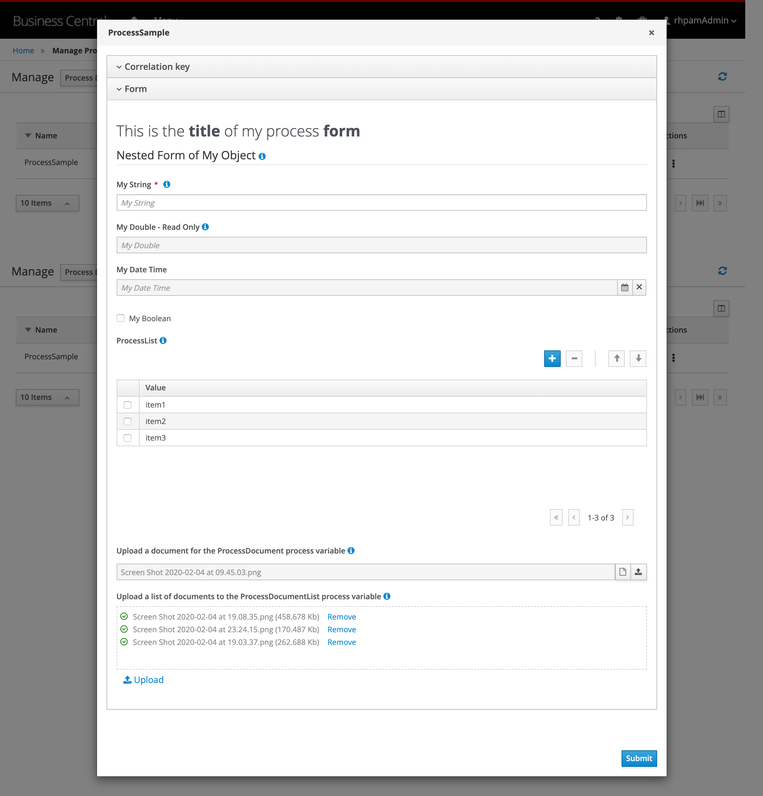

Forms Sample 
==========

This is a sample project to demonstrate how the form modeler tool from business central works with different types of objects. 
- Complex Object (POJO)
- Documents
- Document Lists
- Lists
- Local Date Time
- Multiple Selector
- Combo Box
- Slider
- Input List
- Text Area
- Radio Group
- Checkbox

It also has some tips on the fields, nested forms, read-only fields and default values.

Process Form:

